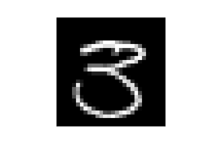

# Digit_Recognizer - Kaggle Competition
## by Baptiste Lemaire

Github link: https://github.com/baptbaptpy/Digit_Recognizer/

This repository was made to show my work on the Digit Recognition competition.
For this contest, we need to create a model that predict the number represented on figures

I mostly use Tensorflow, to create the model and make predictions.
I choose the Lenet-5 architecture for the model.

